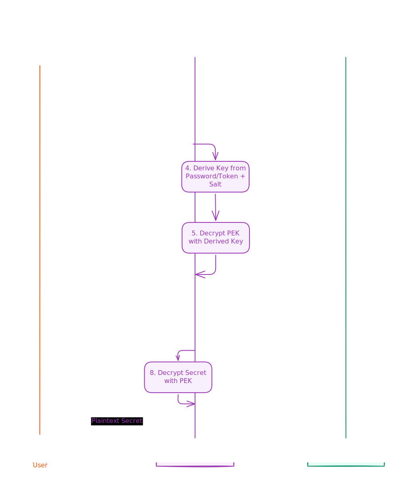

# Redenv: A Zero-Knowledge Secret Management System

**A Developer-First, End-to-End Encrypted CLI for Secure and Dynamic Environment Variable Management, Optimized for the Serverless Era.**

---

## Abstract

In modern software development, managing environment variables and secrets (`.env` files) across different environments, teams, and platforms is a primary source of security vulnerabilities, operational friction, and development slowdowns. The rise of immutable infrastructure on serverless platforms (e.g., Vercel, Netlify) has introduced a new paradigm: the "rebuild to rotate" cycle, where simple configuration changes require a full application redeployment.

**Redenv** is a comprehensive solution designed to solve these problems. It is a CLI-first secret management system that centralizes environment variables in a Redis backend you control. It features a robust, zero-knowledge, end-to-end encrypted architecture, ensuring that your secrets are always protected. By decoupling configuration from deployment, Redenv allows development teams to manage secrets dynamically and securely, drastically improving workflow efficiency and security posture.

## 1. The Research Problem: The State of Configuration Management

The management of application secrets has long been a challenge, but the evolution of development and deployment practices has created two distinct, significant problem areas.

#### 1.1 The Traditional Problem: The Chaos of `.env` Files

The de-facto standard for local development configuration, the `.env` file, is a known anti-pattern when used at scale.

- **Synchronization Drift:** As teams grow, keeping `.env` files synchronized between developers is a constant struggle. This often leads to "works on my machine" issues and hours of lost productivity.
- **Insecure Distribution:** The lack of a central source of truth forces teams into insecure practices, such as sharing secrets over Slack, email, or text messages, creating a massive security liability.

#### 1.2 The Modern Problem: The Inflexibility of Build-Time Secrets

Serverless and edge platforms have revolutionized deployment, but they have also cemented a new problem. By treating environment variables as immutable, build-time constants, they create a rigid and slow workflow for configuration changes.

- **The "Rebuild to Rotate" Cycle:** On these platforms, updating a secret (e.g., rotating a leaked API key) is a high-stakes, time-consuming process. A developer must manually change the variable in a web UI, trigger a new build, and wait for the entire deployment pipeline to complete. In an emergency, this delay is unacceptable.
- **Coupling of Concerns:** This paradigm tightly couples an application's _configuration_ with its _code_. A simple change to a logging level or a feature flag requires the same process as a major code change, creating operational bottlenecks.

## 2. The Redenv Solution: A New Architectural Thesis

Redenv is architected to solve these problems by re-imagining the relationship between an application and its configuration. It is built on four core principles:

1.  **Centralized & Synchronized:** A single source of truth for all secrets, stored in a Redis database you control.
2.  **Secure by Default (Zero-Knowledge):** A robust end-to-end encryption model ensures that the database is considered "untrusted." Your secrets are never stored in plaintext.
3.  **Complete Version History:** Every change to a secret is recorded in an immutable history, providing a full audit trail and enabling instant rollbacks.
4.  **Dynamic & Decoupled:** Redenv is designed to be used with a runtime client (`@redenv/client`), allowing applications to fetch their configuration on startup. This completely decouples secret rotation from the deployment cycle.
5.  **Developer-First Experience:** A powerful and intuitive CLI provides a complete suite of commands covering the entire secret management lifecycle, with UX-focused features like secure password caching.

## 3. System Design & Technology Choices

The effectiveness of Redenv stems from specific, deliberate technology and architectural choices.

#### 3.1 Technology: Built Exclusively for Upstash Redis

Redenv is built exclusively for **Upstash Redis**, a deliberate design choice that enables universal connectivity and unmatched performance.

- **Unmatched Speed:** Upstash provides extremely low-latency data access, which is critical for application startup times. When an application boots, it must load its secrets instantly; any delay increases cold start times and degrades user experience.
- **Serverless Model:** Upstash's serverless pricing and connection model is a perfect fit for CLI tools and serverless functions, which have intermittent, spiky traffic patterns.
- **HTTP-Based Client:** The `@upstash/redis` client operates over a standard HTTP/REST API. This is a crucial advantage, as it guarantees connectivity from any environment, including restrictive corporate networks, serverless functions, and edge workers where traditional TCP connections may be blocked or impractical.

#### 3.2 Security Architecture: A Zero-Knowledge Model

Redenv's security is its most critical component. It is architected to ensure that secrets are only ever held in plaintext on the user's machine or the application's runtime memory—never in the database.

The following diagram illustrates the decryption flow. The reverse process is used for encryption.

- **Per-Project Encryption:** Each project is an isolated security domain protected by a unique **Project Encryption Key (PEK)**.
- **Master Password:** The PEK is "wrapped" (encrypted) by a key derived from a user-provided **Master Password**. This Master Password is known only to the user and is never stored or transmitted.
- **Key Derivation:** We use `PBKDF2-HMAC-SHA256` with `310,000` iterations, a strong, industry-standard Key Derivation Function recommended by OWASP, to protect against brute-force attacks on the Master Password. This is implemented via the universal Web Crypto API, ensuring compatibility across all modern JavaScript runtimes.
- **Authenticated Encryption:** All data, including all historical versions of secrets, is encrypted using `AES-256-GCM`, which provides both confidentiality and integrity.
- **Service Tokens:** For programmatic access, Redenv uses a secure token system. A token consists of a **Public ID** (a non-secret identifier) and a **Secret Key**. The Secret Key is used to decrypt the PEK for a specific project, allowing a server or CI/CD pipeline to securely fetch secrets without a password. This secret is displayed only once upon creation and must be stored securely by the user.

#### 3.3 Data Model in Redis

Redenv uses two primary key formats in Redis to organize data:

- **Metadata Key (`meta@<project-name>`):** A Redis Hash that stores essential metadata for a project. This includes the encrypted Project Encryption Key (PEK), the salt for the Master Password, the history limit setting, and the configuration for any Service Tokens.
- **Environment Key (`<environment-name>:<project-name>`):** A Redis Hash where each field represents a secret's key. The value for each field is a JSON string containing an array of versioned secrets, with the most recent secret at the first index.

This structure provides efficient, project-scoped data retrieval while keeping all secrets for a given environment under a single Redis key.

## 4. Features & Capabilities

Redenv provides a comprehensive suite of commands to manage secrets with confidence.

- **Core Commands:** `add`, `edit`, `view`, `list`, `remove`
- **Project Management:** `register`, `drop`, `switch`
- **Advanced Workflows:** `import`, `export`, `clone`, `diff`, `promote`
- **Auditing & History:** `history` (`view`, `limit`), `rollback`
- **Security & Safety:** `change-password`, `backup`, `restore`, `doctor`, `logout`
- **Application Access:** `token` (`create`, `list`, `revoke`)

## 5. The `@redenv/client`: Dynamic Runtime Secrets

The Redenv ecosystem is completed by the **`@redenv/client`**, a lightweight library for any server-side JavaScript or TypeScript application. It allows applications to fetch, decrypt, and consume secrets securely and dynamically at runtime, fully realizing the vision of decoupling configuration from deployment.

- **High-Performance Caching:** The client features a built-in, in-memory cache with `stale-while-revalidate` logic. This ensures that secrets are served to your application instantly, eliminating latency and providing resilience against network issues, while still keeping secrets up-to-date in the background.
- **Zero-Knowledge, Too:** All cryptographic operations happen on the client side, maintaining the same zero-knowledge security guarantee as the CLI. The application uses a Service Token to decrypt the Project Encryption Key locally.
- **Seamless Integration:** It can automatically populate `process.env` or provide a client object (`get`, `getAll`) for programmatic access, fitting easily into existing application logic.

By using the `@redenv/client`, you can rotate an API key or change a feature flag and have it reflect in your running applications in seconds, without requiring a new build or deployment.

## 6. Comparison with Alternatives

| Feature / Aspect     | Redenv                                  | `.env` Files                             | Cloud Secret Managers (AWS, GCP)         | HashiCorp Vault (Self-Hosted)              |
| -------------------- | --------------------------------------- | ---------------------------------------- | ---------------------------------------- | ------------------------------------------ |
| **Hosting Model**    | Self-managed on Upstash                 | Local files                              | Fully managed by cloud provider          | Fully self-hosted                          |
| **Primary Use Case** | Dynamic secrets for Serverless/Edge/CLI | Local development                        | IAM-integrated secrets for cloud infra   | Enterprise-grade, centralized secret hub   |
| **Security Model**   | **Zero-Knowledge (E2EE)**               | **None** (Plaintext)                     | Server-side encryption with IAM controls | Server-side encryption, requires hardening |
| **Ease of Setup**    | Very High (seconds)                     | High (instant)                           | Medium (requires IAM config)             | Low (complex, requires infrastructure)     |
| **Dynamic Updates**  | **Yes (via `@redenv/client`)**          | No (requires file change + restart)      | Yes (via SDK)                            | Yes (via SDK/API)                          |
| **Cost**             | Low (Upstash free/serverless tier)      | Free                                     | Low to Medium (per secret/per API call)  | High (infrastructure and operational cost) |
| **Version Control**  | **Built-in per secret**                 | Via Git (exposes history if not ignored) | Yes (managed versions)                   | Yes (via audit logs/versioned KV)          |
